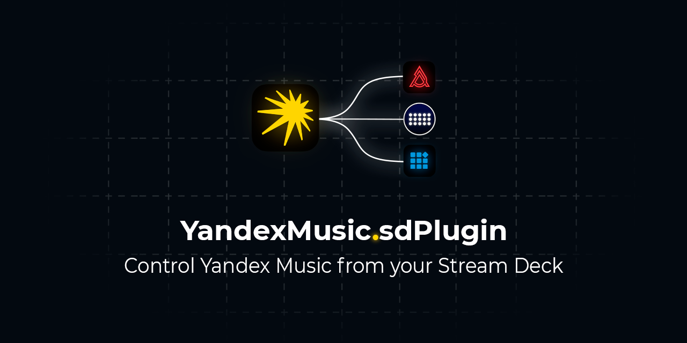

# Yandex Music Integration

<p align="center">
  <a href="README.md">🇬🇧 English</a> | <a href="README_RU.md">🇷🇺 Русский</a>
</p>



<p align="center">
  <b>Control Yandex Music directly from your Stream Deck</b><br>
  Fast • Convenient • No hassle
</p>

<p align="center">
  <a href="https://github.com/Judd1zzz/yandex-music-streamdeck/releases"></a>
  <a href="https://github.com/Judd1zzz/yandex-music-streamdeck/releases"></a>
  <a href="https://github.com/Judd1zzz/yandex-music-streamdeck/stargazers"></a>
  <a href="https://github.com/Judd1zzz/yandex-music-streamdeck/blob/main/LICENSE"></a>
</p>

<p align="center">
  
  
  
</p>

<p align="center">
  <sub>An unofficial, fan-made project. Not affiliated with, endorsed by, or supported by Yandex or the Yandex Music service. All trademarks belong to their respective owners.</sub>
</p>

---

## Compatibility

### Devices

The plugin was developed and tested on **Stream Deck alternatives**: Mirabox, Ajazz (AKP153) and similar devices that use the Ajazz Dock/Stream Dock application.

**Original Elgato Stream Deck**: the plugin launches and displays information correctly (tested on Windows 11, Elgato Stream Deck version 7.0.3). Full testing of all features hasn't been performed yet — if you find bugs, please open an issue.

### Software

The plugin works on **v2** and **v3** versions of the software. To download the latest v3 version:

| Device | Windows | macOS |
|--------|---------|-------|
| **Ajazz** | [ajazz.key123.vip/win](https://ajazz.key123.vip/win) | [ajazz.key123.vip/mac](https://ajazz.key123.vip/mac) |
| **Mirabox / others** | [key123.vip/win](https://key123.vip/win) | [key123.vip/mac](https://key123.vip/mac) |

<details>
<summary><b>Which software to choose?</b></summary>

- If you have **Ajazz** — download from links with `ajazz` in the URL
- If you have **Mirabox** — download Stream Dock (links without `ajazz`)
- **Stream Dock from Mirabox** technically works with Ajazz too:
  - On **Windows** — detects the device normally
  - On **macOS** — sees the device but doesn't connect properly

This happens because Ajazz AKP153 is hardware-wise a clone of Mirabox StreamDock 293S, and the system sees it under that name.

</details>

<details>
<summary><b>For owners of the Russian-market device</b></summary>

The manual that ships with the device often lists links like `ajazz.key123.vip/RUSwin`. If the link ends with **RUS** — you'll download an outdated version of the software.

Use the regular links without RUS. On first launch the software will offer to switch the language.

</details>

---

## Features

### Basic Controls
- **Play/Pause** — pause and resume playback
- **Next/Previous** — switch tracks
- **Like/Dislike** — influence "My Vibe" recommendations
- **Mute** — mute audio without losing volume level

### Volume
- **Volume +/-** — adjust volume by 5% per click
- **Volume indicator** — dedicated button showing current level
- **Volume % inside the client** — the plugin draws the exact value above the Yandex Music slider
- **Volume Knob (dials)** — on devices with rotary knobs (Ajazz/Mirabox like AKP05E Pro): rotate to change volume (configurable step, 5% per tick by default), press for Mute or Play/Pause (configurable). Play/Pause, Next/Prev, Like/Dislike, Mute and Download can also be assigned to a knob — pressing it triggers the action

> **Long press:** smooth adjustment on button hold is implemented in code, but may not work on some Stream Deck alternatives. This appears to be a hardware limitation — the press event only fires when the button is released. On original Stream Deck it should work fine, but hasn't been tested yet.

### Track Info
- **Cover + title + artist** — all on one button
- **Scrolling text** — long titles automatically scroll
- **Copy to clipboard** — click the cover button to copy "Artist - Track" to clipboard
- **Progress bar** — shows track progress: elapsed time, duration or a bar — several styles to choose from

### Discord Rich Presence
- **Current track in your Discord profile** — "Listening" status with title, artist, cover art and progress
- **Works out of the box** — one toggle in the settings, nothing to create
- Want a custom status name/icon — paste your own `Application ID` (optional)

### Download
- **"Download Track" button** on Stream Deck — saves the current track to a file
- **A button right inside the Yandex Music player** — the plugin adds a download button to the client's player bar, next to like
- Formats: **Lossless (FLAC/M4A)** or **MP3 320**, with tags and cover art; folder and format are configurable

### Auto-update (beta)
- **Update check on startup** — new versions are pulled from GitHub automatically
- The feature is new and hasn't been battle-tested yet. If an update doesn't come through — just download the latest release manually, like before: manual installation always works
- Updates are downloaded and written by the plugin itself, so the one-time macOS `xattr` step from the install guide never needs repeating

### Technical Foundation
- **Event-Driven architecture** — instant response, zero CPU load when idle
- **Update-resistant** — track state is read from the player's internal store, with DOM selectors (`data-test-id` + fallbacks) as a safety net
- **Standalone binary** — Rust (`bin/ym-plugin`), no Python or Node.js runtime required

---

## What You'll Need

- A **Yandex Plus** subscription — Yandex Music won't play without it
- The **Yandex Music** desktop client (Windows or macOS) from [music.yandex.ru/download](https://music.yandex.ru/download/) — the old Microsoft Store version is not supported
- A Stream Deck or an alternative (Mirabox/Ajazz) with **v2/v3** software

---

## Installation

### 1. Download the plugin

Get the latest release from [Releases](https://github.com/Judd1zzz/yandex-music-streamdeck/releases) and unpack the archive.

---

### 2. Place the plugin folder in the right location

<details>
<summary></summary>

Place the `com.judd1.yandex_music.sdPlugin` folder in the plugins directory.

Press `Win + R`, paste this path and press Enter:
```
%AppData%\HotSpot\StreamDock\plugins
```

</details>

<details>
<summary></summary>

Place the `com.judd1.yandex_music.sdPlugin` folder in the plugins directory.

In Finder press `Cmd + Shift + G` and paste:
```
~/Library/Application Support/HotSpot/StreamDock/plugins
```

> ⚠️ **Important:** Since the plugin is not signed with an Apple Developer ID, macOS puts it in quarantine. After copying, run this command in Terminal:
> ```bash
> xattr -cr ~/Library/Application\ Support/HotSpot/StreamDock/plugins/com.judd1.yandex_music.sdPlugin
> ```
> Without this, the plugin will fail to start with an "App is damaged" error.
>
> The quarantine mark never comes back on its own — not after a reboot, not after a macOS update. You'll only need this command again if you manually download and unpack a release archive from the browser. Auto-updates are unaffected: the plugin downloads and writes files itself, without the quarantine mark.

</details>

---

### 3. Debug port — the plugin takes care of it

To control the client, the plugin talks to it through a debug port (`--remote-debugging-port=9222`). Yandex Music is an Electron app under the hood (essentially a browser), and this flag opens a local port through which the plugin can "see" the application and control it. The port is only accessible from your own computer (127.0.0.1).

Previously you had to create special shortcuts for this. **Not anymore — the plugin handles the port itself:**

- **Client running without the port?** The plugin will quietly restart it with the right flag. Takes a few seconds, and the client restores your track and queue on its own.
- **Client not running at all?** Press any plugin button — the client will be launched with the port already enabled.
- **Client installed in a non-standard location?** The plugin remembers the path as soon as it sees the client running. You can also set it manually: button settings → "Путь к клиенту".

Don't want the plugin touching your client? Uncheck "Запускать/перезапускать клиент с портом отладки" in any button's settings and use the manual method below.

<details>
<summary><b> — manual method (optional): a special shortcut</b></summary>

1. Find **Yandex Music** in the Start menu
2. Right-click → **Open file location**
3. Right-click on the file → **Create shortcut**
4. Open shortcut properties (right-click → Properties)
5. In the **Target** field, add at the very end (after the closing quote, with a space):
   ```
   --remote-debugging-port=9222
   ```
   
   It should look something like:
   ```
   "C:\Users\...\Яндекс Музыка.exe" --remote-debugging-port=9222
   ```

6. Click OK and pin this shortcut wherever convenient

From now on, launch music **only through this shortcut** (or just let the plugin restart the client for you).

</details>

<details>
<summary> <b>— manual method (optional): a wrapper app</b></summary>

You could open Terminal every time and enter the command, but that gets old fast. Better to create a launcher app once.

#### Create the script

1. Open **Script Editor** — find it via Spotlight
2. Paste:
```applescript
do shell script "open -a '/Applications/Яндекс Музыка.app' --args --remote-debugging-port=9222"
```

If your app is named differently (e.g., "Yandex Music.app"), adjust the path.

#### Export as application

1. File → Export...
2. Name: `Yandex Music Debug` (or whatever you prefer)
3. Where: Applications
4. Format: Application
5. Uncheck all checkboxes
6. Save

Now a new launcher will appear in the Applications folder. Launch music through it.

#### 😘 Bonus: nice icon

The new app will have a default script icon. To restore the original Yandex Music logo:

1. Find the original Яндекс Музыка.app in Applications
2. `Cmd + I` → click on the icon in the top-left corner of the window → `Cmd + C`
3. Find your Yandex Music Debug.app
4. `Cmd + I` → click on the icon → `Cmd + V`

Done, now the launcher looks like the original and works as intended.

</details>

---

### 4. Configure the buttons

1. Open Stream Deck application (Ajazz Dock/Stream Dock)
2. Find the **Yandex Music** category in the actions list on the right
3. Drag the buttons you need onto the panel
4. Click on any button — the settings panel at the bottom will show connection status

If the status shows "Connected" — everything works. If not — check that the Yandex Music client is running through the special shortcut/launcher.

---

## Settings

Per button:

| Parameter | Description |
|-----------|-------------|
| **Control type** | Local (PC client) or Ynison (cloud, beta) |
| **Button style** | Appearance |
| **Display elements** | What to show: cover, title, artist |
| **Progress format** | Progress bar look: timestamps, bar, etc. |

Global — set once, applies everywhere:

| Parameter | Description |
|-----------|-------------|
| **Port** | Connection port to the client (default 9222) |
| **Client autostart** | Plugin launches/restarts the client with the debug port itself (on by default) |
| **Client path** | Only for non-standard installs; empty = auto-detection |
| **Discord** | Rich Presence toggle; your own `Application ID` is optional |
| **Download** | Folder and format: Lossless (FLAC/M4A) or MP3 320 |

---

## Ynison Mode (experimental)

> ⚠️ **This is experimental stuff for those who like to tinker**

> **Note about the Rust version:** full Ynison interaction hasn't been ported yet — the Rust module currently runs as a stub. If you specifically want to experiment with Ynison, use the Python version in [`python_deprecated/`](python_deprecated/) for now — its implementation is more complete. In this release, Ynison is even more "for enthusiasts" than before.

Ynison is Yandex's internal protocol for playback synchronization between devices. In theory, it allows controlling music on your phone, Yandex.Station or TV directly from Stream Deck.

### Why "experimental"

In practice, it's more complicated:

- **Yandex Music PC client** completely blocks control via Ynison. There's a [patch](https://github.com/TheKing-OfTime/YandexMusicModPatcher) that partially solves the problem, but it still doesn't work fully. When I tested, the track queue updated, next track displayed correctly, but the actual track switch on PC didn't happen.
- **Mobile clients** (iOS, Android) work normally — Yandex has a reference implementation there.

Essentially, this mode is a demonstration that it's technically possible. When Yandex finishes their protocol, everything will work properly. For now — it's a toy for enthusiasts.

### What's needed to run

1. Start the local API server (`api_for_plugin`)
2. Enter the authorization token in plugin settings

---

## Technical Details

<details>
<summary><b>☁️ Ynison API Server</b></summary>

This is a separate FastAPI server that acts as a proxy between the plugin and the Ynison protocol. The plugin communicates with it via WebSocket and HTTP, and the server maintains the connection with Yandex.

#### Architecture

```
┌─────────────────────┐      WebSocket       ┌───────────────────────┐
│   Stream Deck       │ ◀──────────────────▶ │   api_for_plugin      │
│   Plugin            │      /ws             │   (FastAPI)           │
└─────────────────────┘                      └───────────────────────┘
                                                       │
                                    ┌──────────────────┴──────────────────┐
                                    │                                     │
                                    ▼                                     ▼
                       ┌────────────────────────┐          ┌──────────────────────────┐
                       │   Ynison WebSocket     │          │   Yandex Music REST API  │
                       │   wss://ynison.music.  │          │   api.music.yandex.net   │
                       │   yandex.ru            │          │   (likes, metadata)      │
                       └────────────────────────┘          └──────────────────────────┘
```

#### Components

| File | Purpose |
|------|---------|
| `main.py` | FastAPI application, endpoints `/ws`, `/control/{action}`, `/check_token` |
| `manager.py` | Session manager. `SessionManager` holds active `YnisonSession` for each token |
| `yandex_api.py` | REST client for Yandex Music: likes, dislikes, track metadata |
| `ynison/player.py` | Ynison player implementation: connection, commands, state processing |
| `ynison/client.py` | Low-level WebSocket client for Ynison |
| `ynison/models/` | Pydantic models for serializing all protocol messages |
| `utils/auth.py` | Token and device_id storage for authentication |

#### Endpoints

**WebSocket `/ws`**
- Header `Authorization: <token>`
- Automatically starts Ynison session for this token on connection
- Receives real-time player state updates (JSON)

**POST `/control/{action}`**
- Actions: `play_pause`, `next`, `prev`, `like`, `dislike`
- Header `Authorization: Bearer <token>` or `Authorization: <token>`
- Returns `{"status": "ok"}`

**GET `/check_token`**
- Validates token
- Returns `{"valid": true}` or `{"valid": false}`

#### Strengths

- **Multi-user mode** — one server for multiple users, lazy sessions
- **Metadata enrichment** — Ynison only provides ID, server fetches covers and names via REST
- **Like synchronization** — liked/disliked lists are loaded on session start
- **Fault tolerance** — auto-reconnect, timeouts, graceful shutdown
- **Pydantic models** — entire protocol is typed and validated

#### Launch

```bash
cd api_for_plugin
pip install -r requirements.txt
python main.py
```

Server will start on `http://0.0.0.0:8000`

</details>

<details>
<summary><b>🖥️ How Local Mode Works (CDP)</b></summary>

Local mode uses Chrome DevTools Protocol to control the Yandex Music client directly, without third-party servers.

#### Architecture

```
┌─────────────────────┐                     ┌───────────────────────────────────────┐
│                     │                     │       Yandex Music (Electron)         │
│    Stream Deck      │                     │                                       │
│      Plugin         │                     │   ┌───────────────────────────────┐   │
│      (Rust)         │      WebSocket      │   │       injected_api.js         │   │
│                     │ ◀─────────────────▶ │   │   (injected script)           │   │
│                     │  ws://localhost:    │   │                               │   │
│  CdpController      │  .../devtools/page  │   │      window.sdNotify() ──────▶│───│──▶ Runtime.bindingCalled
│                     │                     │   │      (callback)               │   │
└─────────────────────┘                     │   └───────────────────────────────┘   │
         │                                  │                                       │
         │ HTTP GET                         │   CDP Debug Port :9222                │
         └─────────────────────────────────▶│   (--remote-debugging-port)           │
           /json/list (get WS URL)          └───────────────────────────────────────┘
```

#### Data Flow

1. **Connection:**
   - Plugin requests `http://localhost:9222/json/list` to get WebSocket URL
   - Opens WebSocket connection to the page via CDP
   - Calls `Runtime.addBinding("sdNotify")` to register callback

2. **Script injection:**
   - Plugin injects `injected_api.js` via `Runtime.evaluate`
   - Script creates `window._PyYMController` object
   - Script starts observing via `MutationObserver`

3. **Receiving updates (event-driven):**
   - When player state changes, script calls `window.sdNotify(JSON)`
   - CDP delivers this via `Runtime.bindingCalled` event
   - Plugin parses payload and updates UI

4. **Sending commands:**
   - Plugin calls `Runtime.evaluate` with controller method
   - For example: `_PyYMController.playPause()`
   - Script finds the right button and emulates click

#### Plugin Components

The backend is a Rust workspace in `com.judd1.yandex_music.sdPlugin/src/`:

| Crate | Purpose |
|-------|---------|
| `crates/ym-cdp/` | CDP client: connection, RPC, event handling, script injection |
| `crates/ym-cdp/assets/injected_api.js` | JS controller: reads player state, commands, **download button inside the client UI** |
| `crates/ym-model/` | State models (`serde`): `MediaState`, `TrackData`, `PlaybackData` |
| `crates/ym-core/` | Actions (buttons), orchestrator, event bus |
| `crates/ym-render/` | Rendering of icons and dynamic buttons |

> Previously the injected script worked "one-way" — it only read state and clicked buttons on the plugin's behalf. Now it also **augments the client's UI**: it adds a download button to the Yandex Music player bar, styled like the native buttons.

#### Why It's Reliable

- **Reads from the player's internal store** — title, artist, cover, progress and volume come from the app's own state, not from fragile markup
- **DOM fallbacks** — if the store is unavailable, multi-layer selectors (`data-test-id` + alternatives) take over
- **Delta updates** — only changed fields are transmitted, not entire state
- **Instant feedback** — the injected script pushes a state delta right after the action, so buttons update almost instantly
- **Auto-reconnect** — plugin reconnects automatically on connection loss

</details>

## For Developers

The backend is written in **Rust** (workspace in `com.judd1.yandex_music.sdPlugin/src/`). The
previous Python backend is kept for reference/rollback in [`python_deprecated/`](python_deprecated/)
and is no longer shipped. `injected_api.js` (injected into the Yandex Music page) is embedded into
the binary at build time from `com.judd1.yandex_music.sdPlugin/src/crates/ym-cdp/assets/injected_api.js`.

### Build

```bash
git clone https://github.com/Judd1zzz/yandex-music-streamdeck.git
cd yandex-music-streamdeck/com.judd1.yandex_music.sdPlugin/src

# Builds the release binary into the shipped package:
#   ../bin/ym-plugin       (macOS universal2, via lipo)
#   ../bin/ym-plugin.exe   (Windows — run on Windows)
cargo run -p xtask -- dist
```

`manifest.json` already points `CodePathMac` / `CodePathWin` at the binary. Builds are
native per platform (macOS and Windows built separately).

### Tests

```bash
cd com.judd1.yandex_music.sdPlugin/src
cargo test --workspace        # Rust unit/integration tests
cargo clippy --workspace      # lints

cd crates/ym-cdp && npm test  # JS contract tests for injected_api.js (node + jsdom)
```

---

## Problems?

| Symptom | Solution |
|---------|----------|
| Buttons don't respond | Press any plugin button — the plugin will launch/restart the client with the right flag itself. If you disabled that toggle, check the client is running with `--remote-debugging-port=9222` |
| Endless "Loading..." | Port 9222 is probably occupied by another app — set a different port in button settings, the plugin will restart the client with it |
| Client in a non-standard folder | Set the path in button settings → "Путь к клиенту" |
| Purple icons | Restart Stream Deck |
| Long press doesn't work | Probably a limitation of your device (see "Volume" section) |
| Discord status doesn't show up | Make sure Discord is running and the Rich Presence toggle is on |
| Update didn't come through | Antivirus may have temporarily locked the files — the plugin retries and will finish the update on the next launch. If your AV flags the unsigned `ym-plugin.exe`, add the plugin folder to exclusions. Manual installation always works as a fallback |

---

## License

MIT. Do whatever you want.

---

## Acknowledgments

- **[Yandex-Music-Ajazz-Plugin](https://github.com/whxtelxs/Yandex-Music-Ajazz-Plugin)** — thanks for the idea of using `--remote-debugging-port` to connect to the client via CDP.
- **[YandexMusicModPatcher](https://github.com/TheKing-OfTime/YandexMusicModPatcher)** — patch for Ynison support on desktop client.
