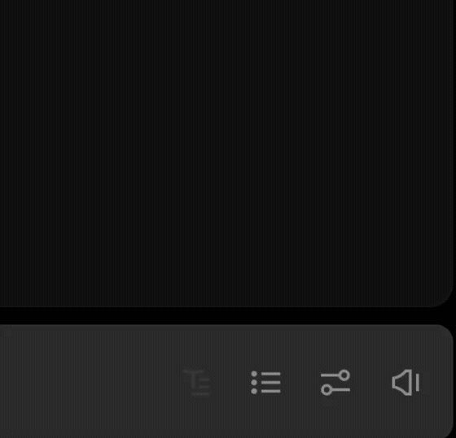
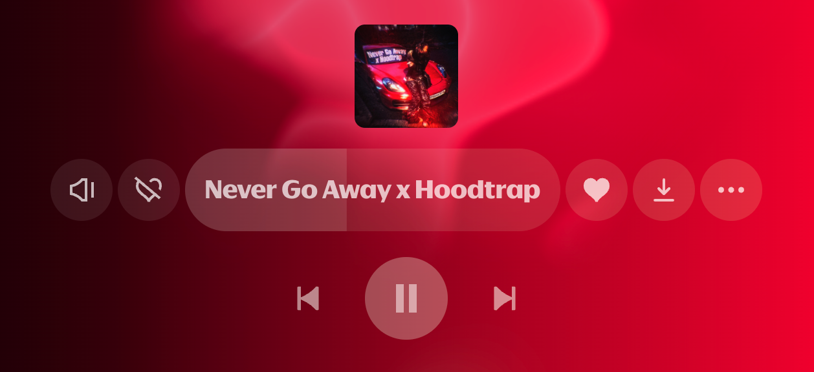

# Интеграция с Яндекс Музыкой

<p align="center">
  <a href="README.md">🇬🇧 English</a> | <a href="README_RU.md">🇷🇺 Русский</a>
</p>


<p align="center">
  <b>Управляйте Яндекс Музыкой прямо со Stream Deck</b><br>
  Быстро • Удобно • Без лишних танцев с бубном
</p>

<p align="center">
  <a href="https://github.com/Judd1zzz/yandex-music-streamdeck/releases"></a>
  <a href="https://github.com/Judd1zzz/yandex-music-streamdeck/releases"></a>
  <a href="https://github.com/Judd1zzz/yandex-music-streamdeck/stargazers"></a>
  <a href="https://github.com/Judd1zzz/yandex-music-streamdeck/blob/main/LICENSE"></a>
</p>

<p align="center">
  
  
  
</p>

<p align="center">
  <a href="https://github.com/Judd1zzz/yandex-music-streamdeck/releases/latest"></a>
  <a href="https://github.com/Judd1zzz/yandex-music-streamdeck/releases/latest"></a>
</p>

<p align="center">
  <a href="https://marketplace.elgato.com/product/yandex-music-integration-43741c24-1784-4492-be32-c631d7c55829"></a>
  <a href="https://space.key123.vip/product/20260706002752"></a>
</p>

<p align="center">
  <sub>Неофициальный любительский проект. Не связан с компанией Яндекс и сервисом Яндекс Музыка и не поддерживается ими. Все упомянутые товарные знаки принадлежат их правообладателям.</sub>
</p>

---

## Совместимость

### Устройства

Плагин разрабатывался и тестировался на **аналогах Stream Deck**: Mirabox, Ajazz (AKP153) и подобных устройствах, работающих через приложение Ajazz Dock/Stream Dock.

**Оригинальный Elgato Stream Deck**: плагин запускается и отображает информацию корректно (проверено на Windows 11, версия Elgato Stream Deck 7.0.3). Полноценное тестирование всех функций ещё не проводилось — если найдёте баги, пишите в issues.

### Софт

Плагин работает на **v2** и **v3** версии софта. Если хотите скачать актуальную версию v3:

| Устройство | Windows | macOS |
|------------|---------|-------|
| **Ajazz** | [ajazz.key123.vip/win](https://ajazz.key123.vip/win) | [ajazz.key123.vip/mac](https://ajazz.key123.vip/mac) |
| **Mirabox / другие** | [key123.vip/win](https://key123.vip/win) | [key123.vip/mac](https://key123.vip/mac) |

<details>
<summary><b>Какой софт выбрать?</b></summary>

- Если у вас **Ajazz** — качайте по ссылкам с `ajazz` в адресе
- Если у вас **Mirabox** — качайте Stream Dock (ссылки без `ajazz`)
- Софт **Stream Dock от Mirabox** технически работает и с Ajazz:
  - На **Windows** — определяет железку нормально
  - На **macOS** — видит устройство, но не подключается корректно

Это происходит потому, что Ajazz AKP153 аппаратно — клон Mirabox StreamDock 293S, и система видит его под этим именем.

</details>

<details>
<summary><b>Для владельцев российской версии железки</b></summary>

В инструкции к устройству часто указаны ссылки вида `ajazz.key123.vip/RUSwin`. Если в конце ссылки есть **RUS** — вы скачаете устаревшую версию софта.

Качайте по обычным ссылкам без RUS. При первом запуске софт сам предложит переключить язык на русский.

</details>

---

## Что умеет плагин

### Базовое управление
- **Play/Pause** — ставьте на паузу и продолжайте воспроизведение
- **Вперёд/Назад** — переключайте треки
- **Лайк/Дизлайк** — влияйте на рекомендации "Моей Волны"
- **Mute** — выключайте звук, не теряя уровень громкости

### Громкость
- **Volume +/-** — регулировка громкости на 5% за нажатие
- **Индикатор громкости** — отдельная кнопка, показывающая текущий уровень
- **Проценты громкости в самом клиенте** — плагин дорисовывает точное значение над ползунком Яндекс Музыки
- **Volume Knob (крутилки)** — на устройствах с энкодерами (Ajazz/Mirabox вроде AKP05E Pro): поворот — громкость (шаг настраивается, по умолчанию 5% за тик), нажатие — Mute или Play/Pause (настраивается). На крутилку также можно назначить Play/Pause, Next/Prev, Like/Dislike, Mute и «Скачать» — сработают по нажатию

> **Длинное нажатие:** в коде реализована плавная регулировка при зажатии кнопки, но на некоторых аналогах Stream Deck она может не работать. Судя по всему, это техническое ограничение устройств — событие нажатия приходит только в момент отпускания кнопки. На оригинальном Stream Deck, скорее всего, всё будет нормально, но пока не проверено.

<p align="center"></p>

### Информация о треке
- **Обложка + название + исполнитель** — всё на одной кнопке
- **Бегущая строка** — длинные названия автоматически прокручиваются
- **Копирование** — нажмите на кнопку с обложкой, чтобы скопировать "Исполнитель - Трек" в буфер обмена
- **Прогресс-бар** — показывает прогресс трека: прошедшее время, длительность или полосу — несколько стилей на выбор

### Discord Rich Presence
- **Текущий трек в профиле Discord** — статус «Слушает» с названием, исполнителем, обложкой и прогрессом
- **Работает из коробки** — включается одним переключателем в настройках, создавать ничего не нужно
- Хотите собственное имя/иконку статуса — впишите свой `Application ID` (опционально)

### Скачивание трека
- **Кнопка «Скачать трек»** на Stream Deck — сохраняет текущий трек в файл
- **Кнопка прямо в плеере Яндекс Музыки** — плагин добавляет кнопку скачивания в плеер-бар клиента, рядом с лайком
- Форматы: **Lossless (FLAC/M4A)** или **MP3 320**, с тегами и обложкой; папка и формат настраиваются

<p align="center"></p>

### Автообновление (бета)
- **Проверка обновлений при запуске** — новые версии подтягиваются с GitHub автоматически
- Функция новая и в бою пока не обкатана. Если обновление не доехало — просто скачайте свежий релиз руками, как раньше: ручная установка всегда работает
- Обновления скачивает и записывает сам плагин, поэтому разовый шаг с `xattr` из инструкции по установке на macOS повторять не придётся

### Техническая база
- **Event-Driven архитектура** — мгновенный отклик, нулевая нагрузка в простое
- **Устойчивость к обновлениям** — состояние трека читается из внутреннего стора плеера, а DOM-селекторы (`data-test-id` и фолбэки) служат страховкой
- **Standalone binary** — Rust (`bin/ym-plugin`), не нужен Python или Node.js

---

## Что понадобится

- Подписка **Яндекс Плюс** — без неё Яндекс Музыка не играет
- Десктопный клиент **Яндекс Музыки** (Windows или macOS) с [music.yandex.ru/download](https://music.yandex.ru/download/) — старая версия из Microsoft Store не поддерживается
- Stream Deck или аналог (Mirabox/Ajazz) с софтом **v2/v3**

---

## Установка

### ⚡ Быстрая установка — Elgato Marketplace (Stream Deck)

<p align="left">
  <a href="https://marketplace.elgato.com/product/yandex-music-integration-43741c24-1784-4492-be32-c631d7c55829"></a>
</p>

У вас оригинальный Elgato Stream Deck? Плагин есть в официальном Marketplace — один клик, и готово:

1. Откройте [страницу плагина в Elgato Marketplace](https://marketplace.elgato.com/product/yandex-music-integration-43741c24-1784-4492-be32-c631d7c55829).
2. Нажмите **Get** — приложение Stream Deck подхватит и установит плагин автоматически.

> Обновления доставляет сам Marketplace. Учтите: в Marketplace-сборке нет действия *«Скачать трек»* и встроенного автообновления (обновляет стор) — всё остальное идентично GitHub-версии.

---

### ⚡ Быстрая установка — StreamDock Store (Mirabox/Ajazz)

<p align="left">
  <a href="https://space.key123.vip/product/20260706002752"></a>
</p>

Плагин доступен в официальном StreamDock Store — без архивов и терминала:

1. Войдите (или бесплатно зарегистрируйтесь) на [space.key123.vip](https://space.key123.vip) и откройте [страницу плагина](https://space.key123.vip/product/20260706002752).
2. Нажмите **Open Software** — приложение StreamDock откроется, скачает и установит плагин автоматически.

> Нужен StreamDock **3.10.185.1120 или новее** и вход в аккаунт Mirabox Space в самом приложении. Внутри приложения плагин живёт в разделе **Space** (не в старой вкладке «Store»). На macOS этот способ не требует снятия карантина.
>
> Хочется поставить руками? Шаги 1–4 ниже.

---

### 1. Скачайте плагин (ручная установка)

<p align="left">
  <a href="https://github.com/Judd1zzz/yandex-music-streamdeck/releases/latest"></a>
  <a href="https://github.com/Judd1zzz/yandex-music-streamdeck/releases/latest"></a>
</p>

Возьмите последний релиз из [Releases](https://github.com/Judd1zzz/yandex-music-streamdeck/releases) и распакуйте архив.

---

### 2. Положите папку плагина в нужное место

<details>
<summary></summary>

Папку `com.judd1.yandex_music.sdPlugin` нужно положить в папку плагинов.

Нажмите `Win + R`, вставьте этот путь и нажмите Enter:
```
%AppData%\HotSpot\StreamDock\plugins
```

</details>

<details>
<summary></summary>

Папку `com.judd1.yandex_music.sdPlugin` нужно положить в папку плагинов.

В Finder нажмите `Cmd + Shift + G` и вставьте:
```
~/Library/Application Support/HotSpot/StreamDock/plugins
```

> ⚠️ **Важно:** Поскольку у плагина нет платной подписи Apple Developer ID, macOS помечает его как "карантинный". После копирования выполните в терминале:
> ```bash
> xattr -cr ~/Library/Application\ Support/HotSpot/StreamDock/plugins/com.judd1.yandex_music.sdPlugin
> ```
> Без этого плагин не запустится и вылетит ошибка "Файл повреждён".
>
> Карантин-метка сама не возвращается — ни после перезагрузки, ни после обновления macOS. Команда понадобится снова, только если вы вручную скачаете и распакуете архив релиза из браузера. Автообновлений это не касается: плагин скачивает и записывает файлы сам, без карантин-метки.

</details>

---

### 3. Порт отладки — плагин разберётся сам

Плагин общается с клиентом через порт отладки (`--remote-debugging-port=9222`). Клиент Яндекс Музыки под капотом — это Electron-приложение (по сути, браузер), и этот флаг открывает локальный порт, через который плагин может "видеть" приложение и управлять им. Порт доступен только с вашего компьютера (127.0.0.1).

Раньше для этого приходилось делать специальные ярлыки. **Больше не нужно — плагин сам следит за портом:**

- **Клиент запущен без порта?** Плагин тихо перезапустит его с нужным флагом. Занимает пару секунд, трек и очередь клиент восстанавливает сам.
- **Клиент вообще не запущен?** Нажмите любую кнопку плагина — клиент откроется сразу с включённым портом.
- **Клиент установлен в нестандартное место?** Плагин запомнит путь, как только увидит запущенный клиент. Можно и указать вручную: настройки кнопки → «Путь к клиенту».

Не хотите, чтобы плагин трогал клиент? Снимите галочку «Запускать/перезапускать клиент с портом отладки» в настройках любой кнопки и пользуйтесь ручным способом ниже.

<details>
<summary><b> — ручной способ (опционально): специальный ярлык</b></summary>

1. Найдите **Яндекс Музыку** в меню Пуск
2. Правый клик → **Открыть расположение файла**
3. Правый клик на файле → **Создать ярлык**
4. Откройте свойства ярлыка (правый клик → Свойства)
5. В поле **Объект** допишите в самый конец (после закрывающей кавычки, через пробел):
   ```
   --remote-debugging-port=9222
   ```
   
   Получится что-то вроде:
   ```
   "C:\Users\...\Яндекс Музыка.exe" --remote-debugging-port=9222
   ```

6. Нажмите OK и закрепите этот ярлык где удобно

С этого момента запускайте музыку **только через этот ярлык** (либо просто позвольте плагину перезапускать клиент самому).

</details>

<details>
<summary> <b>— ручной способ (опционально): приложение-обёртка</b></summary>
Можно каждый раз открывать терминал и вводить команду, но это быстро надоест. Проще один раз сделать приложение-лаунчер.

#### Создаём скрипт

1. Откройте **Редактор скриптов** (Script Editor) — найдите через Spotlight
2. Вставьте:
```applescript
do shell script "open -a '/Applications/Яндекс Музыка.app' --args --remote-debugging-port=9222"
```

Если у вас приложение называется по-другому (например, "Yandex Music.app"), поправьте путь.

#### Экспортируем как приложение

1. Файл → Экспортировать...
2. Имя: `Yandex Music Debug` (или любое другое)
3. Куда: Программы
4. Формат: Программа (Application)
5. Все галочки снимите
6. Сохраните

Теперь в папке Программы появится новый лаунчер. Запускайте музыку через него.

#### 😘 Бонус: красивая иконка

У нового приложения будет стандартная иконка скрипта. Чтобы вернуть оригинальный логотип Яндекс Музыки:

1. Найдите оригинальный Яндекс Музыка.app в Программах
2. `Cmd + I` → кликните на иконку в левом верхнем углу окна → `Cmd + C`
3. Найдите ваш Yandex Music Debug.app
4. `Cmd + I` → кликните на иконку → `Cmd + V`

Готово, теперь лаунчер выглядит как оригинал и работает как надо.

</details>

---

### 4. Настройте кнопки

1. Откройте приложение Stream Deck (Ajazz Dock/Stream Dock)
2. Найдите категорию **Яндекс Музыка** в списке действий справа
3. Перетащите нужные кнопки на панель
4. Кликните на любую кнопку — в панели настроек внизу будет статус подключения

Если статус показывает "Подключено" — всё работает. Если нет — проверьте, что клиент Яндекс Музыки запущен через специальный ярлык/лаунчер.

---

## Настройки

У каждой кнопки — свои:

| Параметр | Что делает |
|----------|------------|
| **Тип управления** | Local (клиент на ПК) или Ynison (облако, бета) |
| **Стиль кнопки** | Внешний вид |
| **Отображаемые элементы** | Что показывать: обложку, название, исполнителя |
| **Формат прогресса** | Вид прогресс-бара: таймкоды, полоса и т.д. |

Общие — задаются один раз и действуют на всё:

| Параметр | Что делает |
|----------|------------|
| **Порт** | Порт подключения к клиенту (по умолчанию 9222) |
| **Автозапуск клиента** | Плагин сам запускает/перезапускает клиент с портом отладки (включено по умолчанию) |
| **Путь к клиенту** | Только для нестандартной установки; пусто = автоопределение |
| **Discord** | Переключатель Rich Presence; свой `Application ID` — опционально |
| **Скачивание** | Папка и формат: Lossless (FLAC/M4A) или MP3 320 |
| **Язык** | Язык панели настроек: английский (по умолчанию) или русский. На русскоязычной системе панель сама предложит переключиться |

---

## Режим Ynison (экспериментальный)

> ⚠️ **Это экспериментальная штука для тех, кто любит ковыряться**

> **Важно про версию на Rust:** в текущем релизе полноценное взаимодействие с Ynison ещё не перенесено — Rust-модуль пока работает как заглушка. Если хочется поэкспериментировать именно с Ynison, берите Python-версию из [`python_deprecated/`](python_deprecated/) — там реализация полнее. По сути, в этом релизе Ynison стал ещё больше «для энтузиастов».

Ynison — это внутренний протокол Яндекса для синхронизации воспроизведения между устройствами. В теории через него можно управлять музыкой на телефоне, Яндекс.Станции или ТВ прямо со Stream Deck.

### Почему "экспериментальный"

На практике всё сложнее:

- **ПК-клиент Яндекс Музыки** вообще блокирует управление через Ynison. Существует [патч](https://github.com/TheKing-OfTime/YandexMusicModPatcher), который частично решает проблему, но полноценно это всё равно не работает. Я когда тестировал, очередь треков обновлялась, следующий трек отображался правильно, но само переключение на ПК не происходило.
- **Мобильные клиенты** (iOS, Android) работают нормально — там у Яндекса эталонная реализация протокола.

По сути, этот режим — демонстрация того, что технически так можно сделать. Когда Яндекс доделает свой протокол, всё заработает как надо. А пока — это игрушка для энтузиастов.

### Что нужно для запуска

1. Запустить локальный API-сервер (`api_for_plugin`)
2. Ввести токен авторизации в настройках плагина

---

## Техническое устройство

<details>
<summary><b>☁️ API-сервер для Ynison</b></summary>

Это отдельный FastAPI-сервер, который выступает прокси между плагином и протоколом Ynison. Плагин общается с ним по WebSocket и HTTP, а сервер уже поддерживает соединение с Яндексом.

#### Архитектура

```
┌─────────────────────┐      WebSocket       ┌───────────────────────┐
│   Stream Deck       │ ◀──────────────────▶ │   api_for_plugin      │
│   Plugin            │      /ws             │   (FastAPI)           │
└─────────────────────┘                      └───────────────────────┘
                                                       │
                                    ┌──────────────────┴──────────────────┐
                                    │                                     │
                                    ▼                                     ▼
                       ┌────────────────────────┐          ┌──────────────────────────┐
                       │   Ynison WebSocket     │          │   Yandex Music REST API  │
                       │   wss://ynison.music.  │          │   api.music.yandex.net   │
                       │   yandex.ru            │          │   (лайки, метаданные)    │
                       └────────────────────────┘          └──────────────────────────┘
```

#### Компоненты

| Файл | Что делает |
|------|------------|
| `main.py` | FastAPI-приложение, эндпоинты `/ws`, `/control/{action}`, `/check_token` |
| `manager.py` | Менеджер сессий. `SessionManager` держит активные `YnisonSession` для каждого токена |
| `yandex_api.py` | REST-клиент для Яндекс Музыки: лайки, дизлайки, метаданные треков |
| `ynison/player.py` | Реализация Ynison-плеера: подключение, команды, обработка state |
| `ynison/client.py` | Низкоуровневый WebSocket-клиент для Ynison |
| `ynison/models/` | Pydantic-модели для сериализации всех сообщений протокола |
| `utils/auth.py` | Хранилище токена и device_id для аутентификации |

#### Эндпоинты

**WebSocket `/ws`**
- Заголовок `Authorization: <token>`
- При подключении автоматически стартует Ynison-сессия для этого токена
- Получает real-time обновления состояния плеера (JSON)

**POST `/control/{action}`**
- Действия: `play_pause`, `next`, `prev`, `like`, `dislike`
- Заголовок `Authorization: Bearer <token>` или `Authorization: <token>`
- Возвращает `{"status": "ok"}`

**GET `/check_token`**
- Проверяет валидность токена
- Возвращает `{"valid": true}` или `{"valid": false}`

#### Сильные стороны

- **Многопользовательский режим** — один сервер на несколько пользователей, ленивые сессии
- **Обогащение метаданных** — Ynison даёт только ID, сервер дозапрашивает обложки и имена через REST
- **Синхронизация лайков** — при старте загружаются списки лайкнутых/дизлайкнутых
- **Отказоустойчивость** — автореконнект, таймауты, graceful shutdown
- **Pydantic-модели** — весь протокол типизирован и валидируется

#### Запуск

```bash
cd api_for_plugin
pip install -r requirements.txt
python main.py
```

Сервер запустится на `http://0.0.0.0:8000`

</details>

<details>
<summary><b>🖥️ Как работает Local режим (CDP)</b></summary>

Local режим использует Chrome DevTools Protocol для управления клиентом Яндекс Музыки напрямую, без сторонних серверов.

#### Архитектура

```
┌─────────────────────┐                     ┌───────────────────────────────────────┐
│                     │                     │       Яндекс Музыка (Electron)        │
│    Stream Deck      │                     │                                       │
│      Plugin         │                     │   ┌───────────────────────────────┐   │
│      (Rust)         │      WebSocket      │   │       injected_api.js         │   │
│                     │ ◀─────────────────▶ │   │    (заинжекченный скрипт)     │   │
│                     │  ws://localhost:    │   │                               │   │
│  CdpController      │  .../devtools/page  │   │      window.sdNotify() ──────▶│───│──▶ Runtime.bindingCalled
│                     │                     │   │      (обратный вызов)         │   │
└─────────────────────┘                     │   └───────────────────────────────┘   │
         │                                  │                                       │
         │ HTTP GET                         │   CDP Debug Port :9222                │
         └─────────────────────────────────▶│   (--remote-debugging-port)           │
           /json/list (получить WS URL)     └───────────────────────────────────────┘
```

#### Поток данных

1. **Подключение:**
   - Плагин запрашивает `http://localhost:9222/json/list` для получения WebSocket URL
   - Открывает WebSocket-соединение к странице через CDP
   - Вызывает `Runtime.addBinding("sdNotify")` для регистрации callback'а

2. **Инъекция скрипта:**
   - Плагин инжектит `injected_api.js` через `Runtime.evaluate`
   - Скрипт создаёт объект `window._PyYMController`
   - Скрипт начинает наблюдение через `MutationObserver`

3. **Получение обновлений (event-driven):**
   - При изменении состояния плеера скрипт вызывает `window.sdNotify(JSON)`
   - CDP доставляет это через событие `Runtime.bindingCalled`
   - Плагин парсит payload и обновляет UI

4. **Отправка команд:**
   - Плагин вызывает `Runtime.evaluate` с методом контроллера
   - Например: `_PyYMController.playPause()`
   - Скрипт находит нужную кнопку и эмулирует клик

#### Компоненты плагина

Бэкенд — Rust workspace в `com.judd1.yandex_music.sdPlugin/src/`:

| Крейт | Что делает |
|-------|------------|
| `crates/ym-cdp/` | CDP-клиент: подключение, RPC, обработка событий, инъекция скрипта |
| `crates/ym-cdp/assets/injected_api.js` | JS-контроллер: чтение состояния плеера, команды, **кнопка скачивания в интерфейсе клиента** |
| `crates/ym-model/` | Модели состояния (`serde`): `MediaState`, `TrackData`, `PlaybackData` |
| `crates/ym-core/` | Действия (кнопки), оркестратор, шина событий |
| `crates/ym-render/` | Рендеринг иконок и динамических кнопок |

> Раньше заинжекченный скрипт работал «в одну сторону» — только читал состояние и нажимал кнопки за плагин. Теперь он ещё и **дополняет интерфейс клиента**: добавляет в плеер-бар Яндекс Музыки кнопку скачивания, оформленную под родные кнопки.

#### Почему это надёжно

- **Чтение из внутреннего стора плеера** — название, исполнитель, обложка, прогресс, громкость берутся из состояния приложения, а не из «хрупкой» вёрстки
- **DOM-фолбэки** — если стор недоступен, в ход идут многослойные селекторы (`data-test-id` и альтернативы)
- **Delta-обновления** — передаём только изменившиеся поля, не весь стейт
- **Мгновенная обратная связь** — после действия скрипт сразу шлёт дельту состояния, кнопки обновляются практически мгновенно
- **Автореконнект** — при разрыве соединения плагин переподключается автоматически

</details>

## Для разработчиков

Бэкенд написан на **Rust** (workspace в `com.judd1.yandex_music.sdPlugin/src/`). Прежняя
Python-реализация оставлена для сверки/отката в [`python_deprecated/`](python_deprecated/) и
больше не поставляется. `injected_api.js` (инжектится в страницу Яндекс Музыки) вшивается в
бинарь на этапе сборки из `com.judd1.yandex_music.sdPlugin/src/crates/ym-cdp/assets/injected_api.js`.

### Сборка

```bash
git clone https://github.com/Judd1zzz/yandex-music-streamdeck.git
cd yandex-music-streamdeck/com.judd1.yandex_music.sdPlugin/src

# Собирает release-бинарь в поставляемый пакет:
#   ../bin/ym-plugin       (macOS universal2, через lipo)
#   ../bin/ym-plugin.exe   (Windows — собирать на Windows)
cargo run -p xtask -- dist
```

`manifest.json` уже указывает `CodePathMac` / `CodePathWin` на бинарь. Сборка нативная под
каждую платформу (macOS и Windows собираются раздельно). Декодирование и ремукс аудио при
скачивании — чистый Rust (Symphonia); MP3 кодирует статически слинкованный LAME
(libmp3lame, LGPL-3.0) — всё внутри единственного бинаря плагина.

### Тесты

```bash
cd com.judd1.yandex_music.sdPlugin/src
cargo test --workspace        # Rust unit/integration тесты
cargo clippy --workspace      # линты

cd crates/ym-cdp && npm test  # JS контракт-тесты injected_api.js (node + jsdom)
```

---

## Проблемы?

| Симптом | Что делать |
|---------|------------|
| Кнопки не реагируют | Нажмите любую кнопку плагина — он сам запустит/перезапустит клиент с нужным флагом. Если вы отключили эту галочку — проверьте, что клиент запущен с `--remote-debugging-port=9222` |
| Вечный "Loading..." | Порт 9222 скорее всего занят другим приложением — укажите другой порт в настройках кнопки, плагин перезапустит клиент уже с ним |
| Клиент в нестандартной папке | Укажите путь в настройках кнопки → «Путь к клиенту» |
| Фиолетовые иконки | Перезапустите Stream Deck |
| Длинное нажатие не работает | Вероятно, ограничение вашего устройства (см. раздел "Громкость") |
| Discord-статус не появляется | Проверьте, что Discord запущен и включён переключатель Rich Presence |
| Обновление не доехало | Антивирус мог временно заблокировать файлы — плагин повторяет попытки и докатит обновление при следующем запуске. Если AV ругается на неподписанный `ym-plugin.exe` — добавьте папку плагина в исключения. Ручная установка всегда работает как запасной вариант |

---

## Лицензия

MIT. Делайте что хотите.

---

## Благодарности

- **[Yandex-Music-Ajazz-Plugin](https://github.com/whxtelxs/Yandex-Music-Ajazz-Plugin)** — спасибо за идею использования `--remote-debugging-port` для подключения к клиенту через CDP.
- **[YandexMusicModPatcher](https://github.com/TheKing-OfTime/YandexMusicModPatcher)** — патч для работы Ynison на десктопном клиенте.
